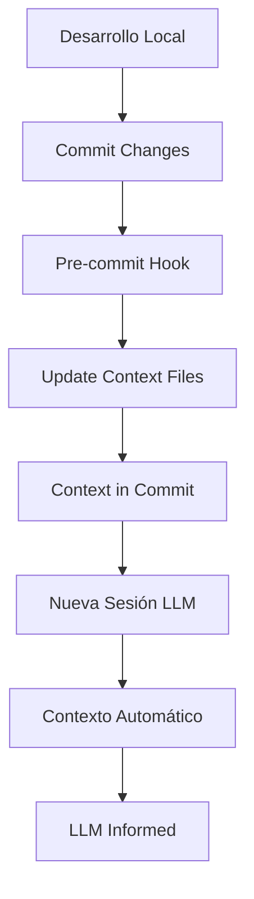

# 🧠 Sistema de Memoria WebSnack - Setup

## **¿Qué es el Sistema de Memoria?**

Un sistema automático que mantiene contexto actualizado del proyecto WebSnack para que los LLMs (Claude, GPT, etc.) mantengan memoria entre sesiones de chat.

## **Componentes del Sistema**

### **1. Archivos de Estado Principal**

- `.github/PROJECT-STATE.md` - Estado general del proyecto
- `llms.txt` - Contexto resumido para LLMs
- `.github/context/` - Archivos de contexto dinámico

### **2. Scripts de Automatización**

- `.github/scripts/update-context.sh` - Actualiza contexto automáticamente
- `.vscode/tasks.json` - Tasks de VSCode para mantenimiento
- `.github/hooks/pre-commit` - Git hook automático

### **3. Integración con Copilot**

- `.github/copilot-instructions.md` - Incluye referencias a archivos de contexto
- Sistema de memoria persistente entre sesiones

## **🚀 Setup Inicial**

### **1. Hacer Ejecutable el Script**

```bash
chmod +x .github/scripts/update-context.sh
```

### **2. Configurar Git Hooks (Opcional)**

```bash
# Copiar hook a directorio git
cp .github/hooks/pre-commit .git/hooks/pre-commit
chmod +x .git/hooks/pre-commit
```

### **3. Ejecutar Primera Actualización**

```bash
# Desde VSCode (Ctrl+Shift+P)
Tasks: Run Task > 🔄 Update Project Context

# O desde terminal
bash .github/scripts/update-context.sh
```

## **📋 Uso Diario**

### **Antes de Nuevas Sesiones LLM**

1. Ejecutar task "🔄 Update Project Context" en VSCode
2. O ejecutar `bash .github/scripts/update-context.sh`
3. Los archivos de contexto se actualizan automáticamente

### **Durante el Desarrollo**

- El sistema se actualiza automáticamente en cada commit (si se configuró el hook)
- Los archivos de contexto reflejan el estado actual del proyecto
- VS Code tasks proporcionan comandos rápidos

### **Para Nuevos LLMs/Chats**

- Los archivos de contexto se referencian automáticamente en `copilot-instructions.md`
- Claude/GPT tendrán contexto actualizado desde el primer mensaje
- No más explicar el proyecto desde cero

## **🔧 Tasks Disponibles en VSCode**

| Task                        | Descripción                              |
| --------------------------- | ---------------------------------------- |
| `🔄 Update Project Context` | Actualiza todos los archivos de contexto |
| `🧠 Generate LLM Context`   | Genera contexto optimizado para LLMs     |
| `📊 Project Status Report`  | Muestra resumen del estado actual        |
| `🚀 Setup WebSnack Project` | Inicializa Next.js 15 con configuración  |

**Acceso**: `Ctrl+Shift+P` → "Tasks: Run Task"

## **📁 Estructura de Archivos de Contexto**

```
.github/
├── PROJECT-STATE.md           # ✅ Estado principal del proyecto
├── context/
│   ├── current-session.md     # ✅ Sesión y variables actuales
│   ├── technical-context.md   # ✅ Stack técnico actualizado
│   └── README.md             # ✅ Documentación del sistema
├── scripts/
│   └── update-context.sh     # ✅ Script de actualización automática
└── hooks/
    └── pre-commit            # ✅ Hook de Git para auto-update

llms.txt                      # ✅ Contexto resumido para LLMs
.vscode/tasks.json           # ✅ Tasks de automatización
```

## **🎯 Beneficios**

### **Para Desarrolladores**

- ✅ No repetir contexto en cada sesión LLM
- ✅ Memoria persistente del proyecto
- ✅ Estado actualizado automáticamente
- ✅ Mejores respuestas de los LLMs

### **Para LLMs (Claude, GPT)**

- ✅ Contexto actualizado desde el primer mensaje
- ✅ Conocimiento del estado actual del proyecto
- ✅ Decisiones técnicas recientes disponibles
- ✅ Problemas y soluciones identificadas

### **Para el Proyecto**

- ✅ Documentación que se mantiene al día automáticamente
- ✅ Historial de decisiones técnicas
- ✅ Tracking de progreso en tiempo real
- ✅ Onboarding automático para nuevos colaboradores

## **🔄 Flujo de Trabajo**



## **🚨 Troubleshooting**

### **Script No Ejecuta**

```bash
chmod +x .github/scripts/update-context.sh
```

### **Git Hooks No Funcionan**

```bash
cp .github/hooks/pre-commit .git/hooks/pre-commit
chmod +x .git/hooks/pre-commit
```

### **Tasks No Aparecen en VSCode**

- Verificar que `.vscode/tasks.json` existe
- Recargar VSCode window (Ctrl+Shift+P → "Reload Window")

## **🎛️ Configuración Avanzada**

### **Auto-update en GitHub Actions**

```yaml
# .github/workflows/update-context.yml
name: Update Project Context
on: [push]
jobs:
  update:
    runs-on: ubuntu-latest
    steps:
      - uses: actions/checkout@v4
      - run: bash .github/scripts/update-context.sh
      - uses: stefanzweifel/git-auto-commit-action@v4
        with:
          commit_message: "🔄 Auto-update project context"
```

### **Integración con Husky**

```bash
# Si usas Husky para git hooks
pnpm add -D husky
echo "bash .github/scripts/update-context.sh" > .husky/pre-commit
```

---

**🎯 Resultado**: Cada nueva sesión de chat con Claude tendrá contexto completo del proyecto WebSnack automáticamente, sin necesidad de explicar el estado actual del desarrollo.
