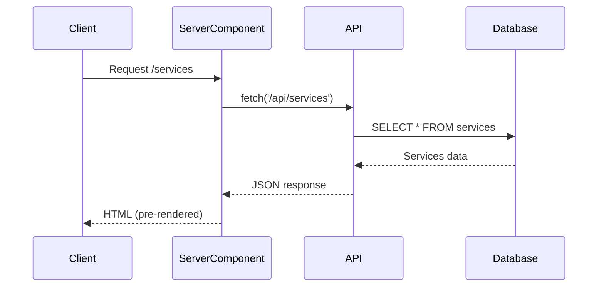

# Prompt: Arquitectura y Estructura - WebCode

## **Contexto y Objetivo**

Prompt consolidado para patrones de arquitectura, layouts, estructura de componentes y organización de código en el proyecto WebCode con Next.js 15 App Router.

---

## **1. ARQUITECTURA DE NEXT.JS 15 APP ROUTER**

### **Principios Fundamentales**

- **Server Components por defecto** - Solo usar 'use client' cuando sea estrictamente necesario
- **Colocación cercana (Colocation)** - Componentes junto a donde se usan
- **Route Groups** - Organizar rutas sin afectar URLs
- **Layouts jerárquicos** - Compartir UI entre rutas relacionadas

### **Estructura de Directorios Recomendada**

```
src/
├── app/                        # App Router - rutas y páginas
│   ├── layout.tsx             # Layout raíz (metadata, fonts, providers)
│   ├── page.tsx               # Página principal
│   ├── components/            # Componentes específicos de página principal
│   │   ├── Hero.Section.tsx
│   │   └── Features.Section.tsx
│   ├── (marketing)/           # Route Group - rutas públicas
│   │   ├── layout.tsx         # Layout con header/footer marketing
│   │   ├── about/page.tsx
│   │   ├── services/
│   │   │   ├── page.tsx
│   │   │   └── components/    # Componentes específicos de Services
│   │   └── blog/
│   │       ├── page.tsx
│   │       └── [slug]/page.tsx
│   ├── (dashboard)/           # Route Group - área privada
│   │   ├── layout.tsx         # Layout con sidebar admin
│   │   └── analytics/
│   │       ├── page.tsx
│   │       └── components/    # Componentes de Analytics
│   └── api/                   # Route handlers
│       └── contact/route.ts
├── components/                 # Componentes compartidos
│   ├── ui/                    # shadcn/ui (NUNCA MODIFICAR)
│   ├── magicui/               # Magic UI animations
│   └── features/              # Bloques funcionales reutilizables
│       ├── shopping-cart/
│       └── search/
├── lib/                       # Utilidades y configuraciones
├── hooks/                     # Custom hooks
├── types/                     # Tipos TypeScript
└── styles/                    # Estilos globales
```

---

## **2. LAYOUTS JERÁRQUICOS**

### **A) Layout Raíz (`app/layout.tsx`)**

```typescript
// Estructura base de toda la aplicación
import type { Metadata } from 'next';
import { Poppins, Space_Grotesk } from 'next/font/google';
import './globals.css';

const poppins = Poppins({
  subsets: ['latin'],
  weight: ['400', '500', '600', '700'],
  variable: '--font-sans'
});

const spaceGrotesk = Space_Grotesk({
  subsets: ['latin'],
  variable: '--font-display'
});

export const metadata: Metadata = {
  title: 'WebCode - Desarrollo Web Barcelona',
  description: 'Soluciones digitales para PYMEs',
};

export default function RootLayout({
  children,
}: {
  children: React.ReactNode;
}) {
  return (
    <html lang="es" suppressHydrationWarning>
      <body className={`${poppins.variable} ${spaceGrotesk.variable} font-sans`}>
        {children}
      </body>
    </html>
  );
}
```

### **B) Layout de Sección (`app/(marketing)/layout.tsx`)**

```typescript
// Layout específico para área de marketing
import { Header } from './components/Header';
import { Footer } from './components/Footer';

export default function MarketingLayout({
  children,
}: {
  children: React.ReactNode;
}) {
  return (
    <>
      <Header />
      <main className="min-h-screen">
        {children}
      </main>
      <Footer />
    </>
  );
}
```

### **C) Layout de Funcionalidad (`app/(dashboard)/layout.tsx`)**

```typescript
// Layout con sidebar y navegación admin
import { Sidebar } from './components/Sidebar';
import { DashboardHeader } from './components/DashboardHeader';

export default function DashboardLayout({
  children,
}: {
  children: React.ReactNode;
}) {
  return (
    <div className="flex h-screen">
      <Sidebar />
      <div className="flex-1 flex flex-col overflow-hidden">
        <DashboardHeader />
        <main className="flex-1 overflow-y-auto p-6">
          {children}
        </main>
      </div>
    </div>
  );
}
```

---

## **3. PATRONES DE COMPONENTES**

### **Convención de Nombres Jerárquica**

```
[NombreSección].[Subsección].[Componente].tsx
```

**Ejemplos:**

- `Hero.Section.tsx` - Componente principal de sección Hero
- `Hero.WavesBackground.tsx` - Fondo animado con olas
- `Services.Features.Card.tsx` - Tarjeta de características

**Reglas:**

- **Componentes principales**: `Page.Section.tsx`
- **Componentes secundarios**: `Page.NombreComponente.tsx`
- **Componentes de tercer nivel**: `Page.Sección.Componente.tsx`

### **Patrón de Server Component**

```typescript
// src/app/services/page.tsx
interface Service {
  id: string;
  title: string;
  description: string;
  price: number;
}

export default async function ServicesPage() {
  // Fetch en Server Component
  const services: Service[] = await fetch('/api/services', {
    cache: 'force-cache', // o 'no-store', 'revalidate'
  }).then(res => res.json());

  return (
    <main className="container mx-auto px-4 py-8">
      <h1 className="text-3xl font-bold mb-8">Servicios</h1>
      <div className="grid grid-cols-1 md:grid-cols-2 lg:grid-cols-3 gap-6">
        {services.map((service) => (
          <ServiceCard key={service.id} service={service} />
        ))}
      </div>
    </main>
  );
}
```

### **Patrón de Client Component**

```typescript
'use client';

// Usar 'use client' solo cuando sea necesario:
// - Hooks de React (useState, useEffect)
// - Event handlers (onClick, onChange)
// - Browser APIs (localStorage, window)
// - Librerías que requieren cliente (framer-motion)

import { useState } from 'react';

export function InteractiveComponent() {
  const [count, setCount] = useState(0);

  return (
    <button onClick={() => setCount(count + 1)}>
      Clicks: {count}
    </button>
  );
}
```

---

## **4. COLOCACIÓN CERCANA VS FEATURES**

### **Usar Colocación Cercana (app/\*/components/) cuando:**

- El componente **solo se usa en una página específica**
- Es parte de la **funcionalidad principal** de esa ruta
- Es un **componente de presentación** sin lógica compleja

### **Usar Features (src/components/features/) cuando:**

- El componente **se reutiliza en múltiples páginas**
- Tiene **lógica de negocio compleja**
- Es un **módulo funcional completo** (carrito, búsqueda)

### **Ejemplo Práctico**

```
# ✅ Colocación Cercana
app/components/HeroSection.tsx          # Solo en página principal
app/services/components/ServiceCard.tsx # Solo en servicios

# ✅ Features Reutilizables
src/components/features/shopping-cart/
  ├── ShoppingCart.tsx
  ├── CartItem.tsx
  └── useCart.ts
```

---

## **5. ROUTE GROUPS**

### **Objetivo**

Agrupar rutas sin afectar la estructura de URLs:

```
app/(marketing)/about/page.tsx     → /about
app/(marketing)/services/page.tsx  → /services
app/(dashboard)/orders/page.tsx    → /orders
```

### **Ventajas**

- ✅ Layouts compartidos por grupo
- ✅ Organización lógica sin cambiar URLs
- ✅ Separación de áreas funcionales (público vs admin)

---

## **6. DIAGRAMAS DE ARQUITECTURA**

### **Flujo de Componentes**

```mermaid
flowchart TD
    A[app/layout.tsx<br/>Root Layout] --> B[app/(marketing)/layout.tsx<br/>Marketing Layout]
    A --> C[app/(dashboard)/layout.tsx<br/>Dashboard Layout]

    B --> D[app/(marketing)/page.tsx<br/>Home Page]
    B --> E[app/(marketing)/services/page.tsx<br/>Services Page]

    C --> F[app/(dashboard)/analytics/page.tsx<br/>Analytics Page]

    D --> G[app/components/Hero.Section.tsx]
    E --> H[app/services/components/ServiceCard.tsx]
    F --> I[app/analytics/components/Chart.tsx]

  style A fill:rgb(220,124,179)
  style B fill:rgb(188,227,229)
  style C fill:rgb(188,227,229)
```

### **Flujo de Datos**



---

## **7. MEJORES PRÁCTICAS**

### **Organización de Archivos**

- ✅ **Nombres descriptivos** (evitar index.tsx genéricos)
- ✅ **Colocación cercana** como patrón por defecto
- ✅ **Carpetas con \_** para código privado (no genera rutas)
- ✅ **Route Groups** para organización lógica

### **Layouts**

- ✅ **Layout raíz** para metadata, fonts, providers globales
- ✅ **Layouts de sección** para header/footer compartidos
- ✅ **Layouts de funcionalidad** para navigation/sidebar

### **Componentes**

- ✅ **Named exports** para componentes reutilizables
- ✅ **Default exports** solo para page.tsx y layout.tsx
- ✅ **Convención jerárquica** para nombres claros
- ✅ **Server Components** por defecto

### **Tipos TypeScript**

- ✅ **Interfaces** para props de componentes
- ✅ **Types** para estructuras de datos
- ✅ **Prohibido** usar `any`

---

## **8. TROUBLESHOOTING**

### **Error: Cannot use 'use client' in Server Component**

```typescript
// ❌ Incorrecto: hooks en Server Component
export default async function Page() {
  const [state, setState] = useState(0); // ERROR
  return <div>{state}</div>;
}

// ✅ Correcto: extraer a Client Component
'use client';
export function Counter() {
  const [state, setState] = useState(0);
  return <button onClick={() => setState(state + 1)}>{state}</button>;
}
```

### **Error: Layout no se aplica**

- Verificar que el layout.tsx está en el **nivel correcto** de la jerarquía
- Verificar que exporta **default function** con nombre correcto
- Verificar que acepta **children** como prop

### **Error: Componente no se encuentra**

- Verificar **rutas de importación** (alias @/\* configurado)
- Verificar **nombres de archivo** (mayúsculas/minúsculas)
- Verificar **exportación** (named vs default)

---

## **REFERENCIAS**

- Next.js 15 App Router Documentation
- React 19 Server Components
- File-based Routing Patterns
